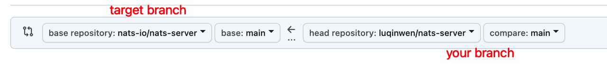

# Slava 🎩
A High-performance、K-V Cloud Database.<br>


[](https://pkg.go.dev/github.com/luqinwen/slava)
<br>


## 目录结构设计
1. /web<br>
   前端代码存放目录，主要用来存放 Web 静态资源，服务端模板和单页应用（SPAs）。后期考虑会实现slava的可视化页面。


2. /cmd<br>
一个项目有很多组件，可以把组件 main 函数所在的文件夹统一放在/cmd 目录下。<br>
    每个组件的目录名应该跟你期望的可执行文件名是一致的。这里要保证 /cmd/<组件名> 目录下不要存放太多的代码，如果你认为代码可以导入并在其他项目中使用，那么它应该位于 /pkg 目录中。如果代码不是可重用的，或者你不希望其他人重用它，请将该代码放到 /internal 目录中。


3. /internal<br>
    存放私有应用和库代码。如果一些代码，你不希望在其他应用和库中被导入，可以将这部分代码放在/internal 目录下。在引入其它项目 internal 下的包时，Go 语言会在编译时报错
   ```   
   An import of a path containing the element “internal” is disallowed
   if the importing code is outside the tree rooted at the parent of the
   "internal" directory.
   ```
   可以通过 Go 语言本身的机制来约束其他项目 import 项目内部的包。/internal 目录建议包含如下目录：
   - /internal/apiserver：该目录中存放真实的应用代码。这些应用的共享代码存放在/internal/pkg 目录下。
   - /internal/pkg：存放项目内可共享，项目外不共享的包。这些包提供了比较基础、通用的功能，例如工具、错误码、用户验证等功能。
     Tips：一开始将所有的共享代码存放在 /internal/pkg 目录下，当该共享代码做好了对外开发的准备后，再转存到/pkg目录下
     /internal 目录大概分为 3 类子目录：
   - /internal/pkg：内部共享包存放的目录。
   - /internal/authzserver、/internal/apiserver、/internal/pump、/internal/iamctl：应用目录，里面包含应用程序的实现代码。
   - /internal/iamctl：对于一些大型项目，可能还会需要一个客户端工具。

   在每个应用程序内部，也会有一些目录结构，这些目录结构主要根据功能来划分：
   - /internal/apiserver/api/v1：HTTP API 接口的具体实现，主要用来做 HTTP 请求的解包、参数校验、业务逻辑处理、返回。注意这里的业务逻辑处理应该是轻量级的，如果业务逻辑比较复杂，代码量比较多，建议放到
   - /internal/apiserver/service 目录下。该源码文件主要用来串流程。
   - /internal/apiserver/options：应用的 command flag。
   - /internal/apiserver/config：根据命令行参数创建应用配置。
   - /internal/apiserver/service：存放应用复杂业务处理代码。/internal/apiserver/store/mysql：一个应用可能要持久化的存储一些数据，这里主要存放跟数据库交互的代码，比如 Create、Update、Delete、Get、List 等。

   /internal/pkg 目录存放项目内可共享的包，通常可以包含如下目录：
   - /internal/pkg/code：项目业务 Code 码。
   - /internal/pkg/validation：一些通用的验证函数。/internal/pkg/middleware：HTTP 处理链。

4. /pkg<br>
   /pkg 目录是 Go 语言项目中非常常见的目录，我们几乎能够在所有知名的开源项目（非框架）中找到它的身影，例如 Kubernetes、Prometheus、Moby、Knative 等。该目录中存放可以被外部应用使用的代码库，其他项目可以直接通过 import 导入这里的代码。所以，我们在将代码库放入该目录时一定要慎重。


5. /third_party<br>
   外部帮助工具，分支代码或其他第三方应用（例如 Swagger UI）。比如我们 fork 了一个第三方 go 包，并做了一些小的改动，我们可以放在目录 /third_party/forked 下。一方面可以很清楚的知道该包是 fork 第三方的，另一方面又能够方便地和 upstream 同步。


6. /test<br>
   用于存放其他外部测试应用和测试数据。/test 目录的构建方式比较灵活：对于大的项目，有一个数据子目录是有意义的。例如，如果需要 Go 忽略该目录中的内容，可以使用 /test/data 或 /test/testdata 目录。需要注意的是，Go 也会忽略以“.”或 “_” 开头的目录或文件。这样在命名测试数据目录方面，可以具有更大的灵活性。


7. /configs<br>
   这个目录用来配置文件模板或默认配置。


8. /deployment<br>
   用来存放 Iaas、PaaS 系统和容器编排部署配置和模板（Docker-Compose，Kubernetes/Helm，Mesos，Terraform，Bosh）。在一些项目，特别是用 Kubernetes 部署的项目中，这个目录可能命名为 deploy。为什么要将这类跟 Kubernetes 相关的目录放到目录结构中呢？主要是因为当前软件部署基本都在朝着容器化的部署方式去演进。


9. /docs<br>
   存放设计文档、开发文档和用户文档等（除了 godoc 生成的文档）。推荐存放以下几个子目录：
- /docs/devel/{en-US,zh-CN}：存放开发文档、hack 文档等。
- /docs/guide/{en-US,zh-CN}: 存放用户手册，安装、quickstart、产品文档等，分为中文文档和英文文档。
- /docs/images：存放图片文件。

10. /api<br>
   /api 目录中存放的是当前项目对外提供的各种不同类型的 API 接口定义文件，其中可能包含类似 /api/protobuf-spec、/api/thrift-spec、/api/http-spec、openapi、swagger 的目录，这些目录包含了当前项目对外提供和依赖的所有 API 文件。例如，如下是 IAM 项目的 /api 目录：
    ```
    ├── openapi/
    │   └── README.md
    └── swagger/
    ├── docs/
    ├── README.md
    └── swagger.yaml
    ```
    二级目录的主要作用，就是在一个项目同时提供了多种不同的访问方式时，可以分类存放。用这种方式可以避免潜在的冲突，也能让项目结构更加清晰。

## PR规范
1. commit message 必须以todo编号: message 的样式做记录<br>

>**分支type：<br>**
>
>feature - 新功能 feature<br>
>fix - 修复 bug<br>
>docs - 文档注释<br>
>style - 代码格式(不影响代码运行的变动)<br>
>refactor - 重构、优化(既不增加新功能，也不是修复bug)<br>
>perf - 性能优化<br>
>test - 增加测试<br>
>chore - 构建过程或辅助工具的变动<br>
>revert - 回退<br>
>build - 打包<br>

2. todo编号的命名规则是：分支type/版本号-***（三位数的编号），eg: feature:0-001
3. 多个commit需要squash后再进行提交
4. 合并分支commit和rebase结合使用
>使用 rebase 和 merge 的基本原则：
>
>- 下游分支更新上游分支内容的时候使用 rebase
>- 上游分支合并下游分支内容的时候使用 merge
>- 更新当前分支的内容时一定要使用 --rebase 参数
>
>例如现有上游分支 master，基于 master 分支拉出来一个开发分支 dev，在 dev 上开发了一段时间后要把 master 分支提交的新内容更新到 dev 分支，此时切换到 dev 分支，使用 git rebase >master
>
>等 dev 分支开发完成了之后，要合并到上游分支 master 上的时候，切换到 master 分支，使用 git merge dev
5. Commit 信息规范：
> 0-002:summary
>
> 1. fix the bug xxx
> 2. xxx
> 3. xxx
6. 提交分支 feature/v0、test/v0（不要提交到main分支，由我来做最后的合并）
   
7. 提交pr后需要拉一个1-1的会与我对齐你的进度以及讲解你的代码同时进行code review，同时需要提交一份你的测试报告（**包括pr概述、测试用例、测试结果截图**）。
   [测试报告模板](https://gbvsqqoj6n.feishu.cn/docx/CoiNdwYb4orlxYxHtCBcK64EnLf)

## 关于提交 PR 的方法：
### Step1:
首先你需要 fork 本仓库到你自己的 github 仓库，点击右上角的 fork 按钮（**切忌只fork main分支！**）。
### Step2:
使用 git clone 命令将本仓库拷贝到你的本地文件，git clone 地址请点开项目上方的绿色 "code" 按钮查看。
### Step3:
在你的本地按照todo对代码进行修改、提交。
### Step4:
修改完后，是时候该上传你的改动到你 fork 来的远程仓库上了。你可以用 git bash，也可以使用 IDE 里的 git 来操作。对于 git 不熟的用户建议使用 IDE，IDE 也更方便写 commit 信息。
### Step5:
上传之后，点进你的仓库主页，会出现一个 "Contribute"，点击它，选择 "Open pull request"，选择好你仓库的分支和你想要在这里合并的分支后，点击 "Create pull request"，之后填写你的 PR 标题和正文内容，就成功提交一个 PR 。接下来等待我的approve/feedback。
### Step6 (optional):
记得检查修改自己的 GitHub Public profile 里的 Name 和 Public email，位置在右上角头像的 Settings 里，因为大多数情况下我们会使用 squash merge 来合并 PRs，此时 squash merge 后产生的新提交作者信息会使用这个 GH 信息。

## Todo
### [slava开发看板](https://gbvsqqoj6n.feishu.cn/docx/VtzXdoU7coNdLLxtHnmc9MkGnxf)
### V0（计划开发周期1.9～3.27）

| Todo codes   | Issues |Contributors|
| :----- | :-----  |:-----|
| docs:0-001|  1. Readme update  | [Qinwen](https://github.com/luqinwen)|
| ......|  ...... | ......|
| feature:0-019|  1. LRU 2. LFU ||
| feature:0-020|1. Geohash|| 
|feature:0-021|1. Clusters<br>2. Consistent Hashing||
|feature:0-022|1. TCC||
|feature:0-023|1. TTL||
| ......|  ...... | ......|
|feature:0-036|1. Quicklist||
|feature:0-037|1. Linkedlist||


### V1（Docker+K8S/Cloud K-V Database）
| Todo codes   | Issues |Contributors|
| :----- | :-----  |:-----|
| docs: 1-001|  1. Readme update  | [Qinwen](https://github.com/luqinwen)|
| chore:1-002|  1. Docker compose | |
| feature:1-003|  1. Generate Make file  | |
| feature:1-004|  1. CI\CD | |
| refactor:1-005| 1. Go 1.17——>1.20 | |

## Reference Urls：
1. [github地址](https://github.com/luqinwen/slava)
2. [git操作参考](https://www.runoob.com/git/git-tutorial.html)
3. [小林coding](https://xiaolincoding.com/redis/)
4. [极客时间: Redis核心技术与实战](https://time.geekbang.org/column/intro/100056701)
5. [7-days http server](https://geektutu.com/post/gee-day1.html)
6. [代码规范](https://bbs.huaweicloud.com/blogs/291830)
7. [Google 开源项目风格：格式 ‒ Google 开源项目风格指南](https://zh-google-styleguide.readthedocs.io/en/latest/google-cpp-styleguide/formatting/)
8. [Jenkins:创建您的第一个Pipeline](https://www.jenkins.io/zh/doc/pipeline/tour/hello-world/)
9. [Jenkins for go](https://plugins.jenkins.io/golang/)
10. [google云原生应用构建指南](https://cloud.google.com/resources/rearchitecting-to-cloud-native?hl=zh-cn)
11. Go 程序员面试笔试宝典
12. [GraphSQL](https://mp.weixin.qq.com/s/777ys6Pavip9rmnQ145OQw)
13. [gRPC 官方文档中文版_V1.0](https://doc.oschina.net/grpc?t=60133)
14. [Linux Shell命令](https://plantegg.github.io/2017/01/01/top_linux_commands/)
15. [常用的命令行技巧](https://iaguozhi.github.io/blogs/shell-command-tips.html)
16. [Ginkgo](https://www.ginkgo.wiki/gong-xiang-shi-li-mo-shi.html)
17. [testing - 单元测试 · Go语言标准库](https://books.studygolang.com/The-Golang-Standard-Library-by-Example/chapter09/09.1.html)
18. [后端 - Redis从入门到高可用，分布式实践](https://www.aliyundrive.com/s/tAB72ggpbqF)